# MyMemories ｜ 我的记忆点 

零、前言

MyMemories ｜ 我的记忆点 

这是XMUTKKC SIST 的`HarmonyOS(鸿蒙)开发入门` 课程设计

由本作者书写的代码部分使用 AGPLv3 许可证授权

本人朋友及本人为我设计个人的Logo:

|                                    旧版 Logo                                     |                                    新版 Logo                                     |
|:------------------------------------------------------------------------------:|:------------------------------------------------------------------------------:|
|  |  |

BUG反馈：https://github.com/hixy-dev/MyMemories/issues

除了项目中列出的邮箱
还可以通过国际计算机学会（ACM）提供的邮箱联系我：
titusyu@acm.org


一、移动APP简介

MyMemories 是一款专注于“倒数日”与“纪念日”管理的 HarmonyOS NEXT 移动应用，基于API版本 21。它旨在帮助用户以极简、优雅的方式记录生活中的重要时刻——无论是即将到来的考试、生日、假期，还是值得铭记的纪念日。
应用采用清新现代的 UI 设计，支持事件的增删改查、日历视图查看、数据导入导出等功能。我们的标语是：“让时光有迹可循，让记忆温暖如初。”

二、移动APP功能设计与相关技术

2.1 系统总体设计
本系统采用模块化设计，主要包含以下核心模块：
- 首页模块：展示应用头图、核心数据统计（即将到来/纪念回顾）以及按时间排序的事件列表。
- 记忆模块：提供月历视图，支持按日期筛选事件，方便用户回顾特定日期的记忆。
- 详情与编辑模块：查看事件详细信息（含备注），支持新建事件或对已有事件进行编辑、删除。
- 关于与设置模块：展示应用版本、开发者信息（含联系方式）、以及开发者调试模式（数据管理）。

系统的总体功能结构如图1所示（示意图）：
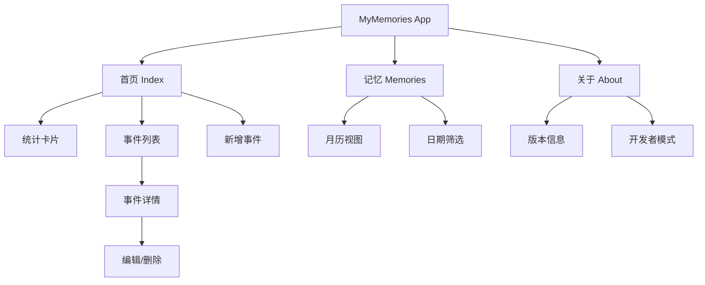

2.2 功能详细设计
（1）事件管理（新增/编辑/删除）
- 功能描述：用户可以通过首页的“+”按钮新增事件，或在详情页点击“编辑”修改事件。支持设置标题、日期、类型（倒数日/纪念日）以及备注信息。在详情页或编辑页底部，用户可以删除不再需要的事件，删除前会有二次确认弹窗防止误操作。
- 使用技术或知识点：
  - ArkUI 组件：`TextInput`, `TextArea`, `DatePicker`, `Button`, `Stack`（底部按钮固定）。
  - 数据持久化：使用 HarmonyOS 的 `relationalStore` (RDB) 进行 SQLite 数据库的增删改查操作。
  - 路由跳转：`router.push` 与 `router.back` 实现页面间传参和切换。

（2）首页展示与统计
- 功能描述：首页顶部展示精美的 Banner 图（记录重要时刻），下方通过两个统计卡片直观展示“即将到来”和“纪念回顾”的事件数量。列表区域按剩余天数自动排序，让紧迫的事件优先展示。
- 使用技术或知识点：
  - 列表渲染：`List` + `ForEach` 高效渲染长列表。
  - 日期计算：封装 `dateUtils` 工具类，计算两个日期之间的天数差。
  - 状态管理：使用 `@State` 和 `@Prop` 驱动 UI 自动刷新。

（3）记忆日历
- 功能描述：以月历形式展示时间流，用户可以切换月份，点击具体日期查看当天的事件。
- 使用技术或知识点：
  - 自定义构建函数：`@Builder` 构建日历网格。
  - 逻辑处理：计算每月天数、第一天是周几，动态生成日历数据。

（4）关于与开发者模式
- 功能描述：展示应用 Logo（由 IGE 设计）、版本号、Slogan 及开发者联系方式（酷安、小红书、QQ/微信）。内置“开发者模式”，支持 JSON 格式的数据导入导出，方便数据迁移和备份。
- 使用技术或知识点：
  - 剪贴板操作：`pasteboard` 实现数据的复制与粘贴。
  - 交互反馈：`promptAction.showToast` 提供操作结果提示。

三、数据来源

本系统使用 HarmonyOS 本地数据库（RDB）存储所有用户数据，不依赖网络接口，保障隐私安全。
数据库名为 `memories.db`，核心表 `memories` 设计如下：

| 字段名 | 类型      | 描述 | 备注 |
| :--- |:--------| :--- | :--- |
| id | INTEGER | 事件ID | 主键，自增 |
| task_name | TEXT    | 事件标题 | 必填 |
| finished | NUMBER  | 事件类型 | 0: 倒数日, 1: 纪念日 |
| target_date | NUMBER | 目标日期 | 毫秒级时间戳 |
| content | TEXT    | 备注信息 | 选填 |

如果是 JSON 数据导入导出，格式如下：
```json
[
  { "title": "恋爱纪念日", "date": 1672502400000, "type": "anniversary", "note": "在一起的第一天" },
  { "title": "考研倒计时", "date": 1703260800000, "type": "countdown", "note": "加油！" }
]
```

四、系统成果

4.1 首页与列表
首页采用清新的蓝紫色调 Banner，统计卡片清晰明了。列表项展示事件标题、日期及剩余/已过天数，左侧图标根据类型区分颜色（蓝色为倒数日，橙色为纪念日）。

| 首页概览 | 新增事件 |
| :---: | :---: |
| 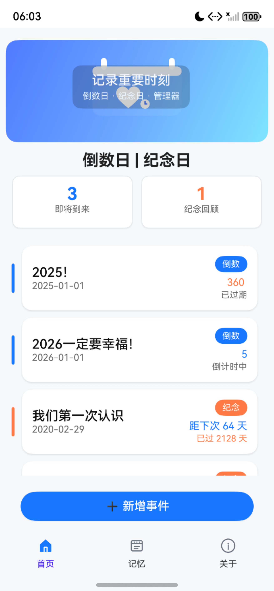 | 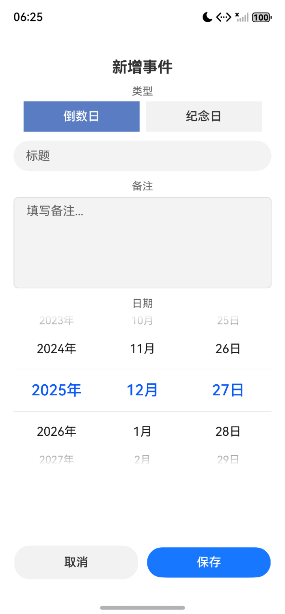 |

4.2 记忆日历
以月历形式展示时间流，支持日期筛选，方便回顾特定日期的记忆。

| 记忆月历 | 日期筛选 |
| :---: | :---: |
| 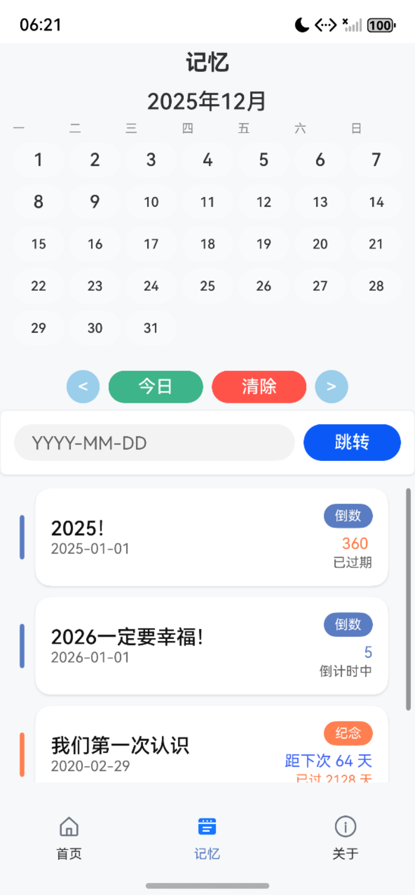 | 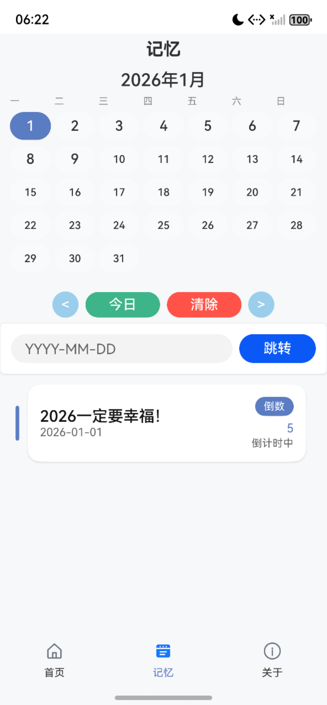 |

4.3 编辑与详情
详情页展示完整信息，底部固定操作按钮；编辑页表单简洁，支持备注输入。

| 事件详情 | 删除确认 |                        编辑页面                         |
| :---: | :---: |:---------------------------------------------------:|
| 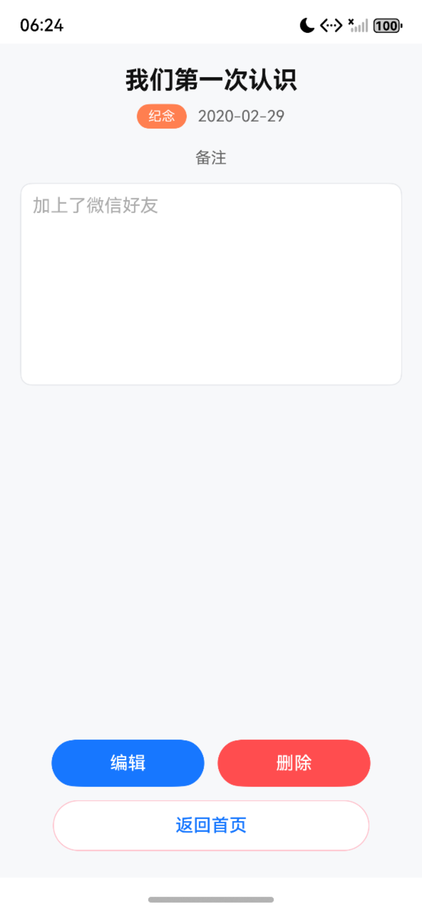 | 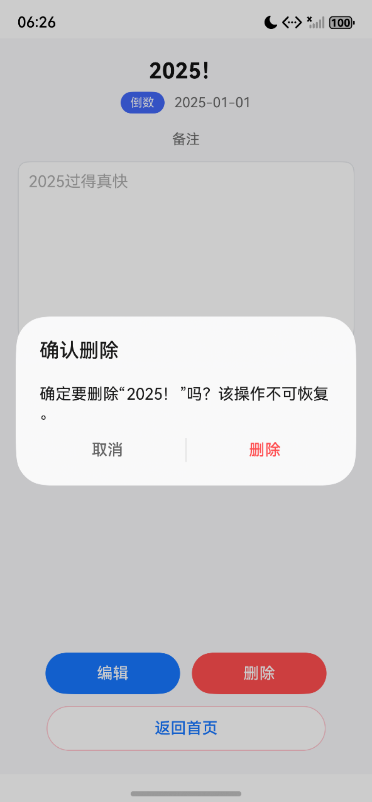 | 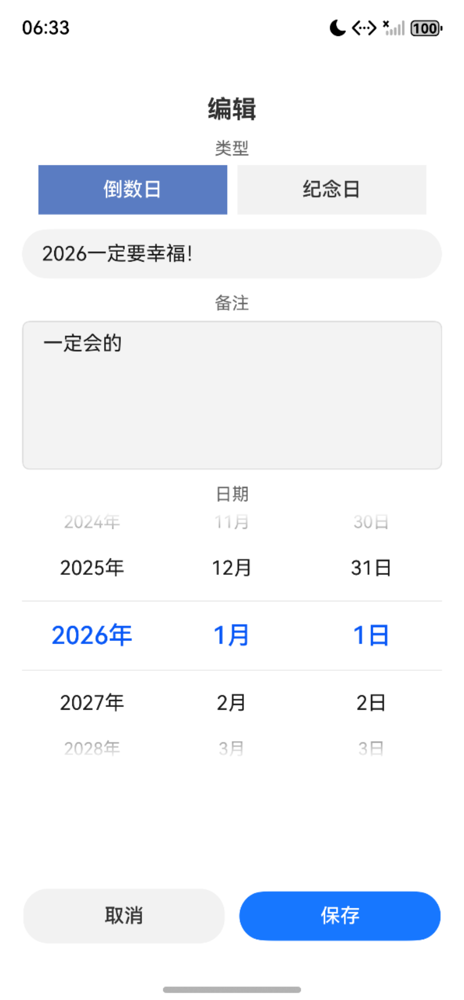 |

4.4 关于页面与开发者模式
关于页面展示应用信息与致敬；开发者模式支持数据导入导出与清理。

| 关于页面 | 导出数据 | 导入数据 |
| :---: | :---: | :---: |
| 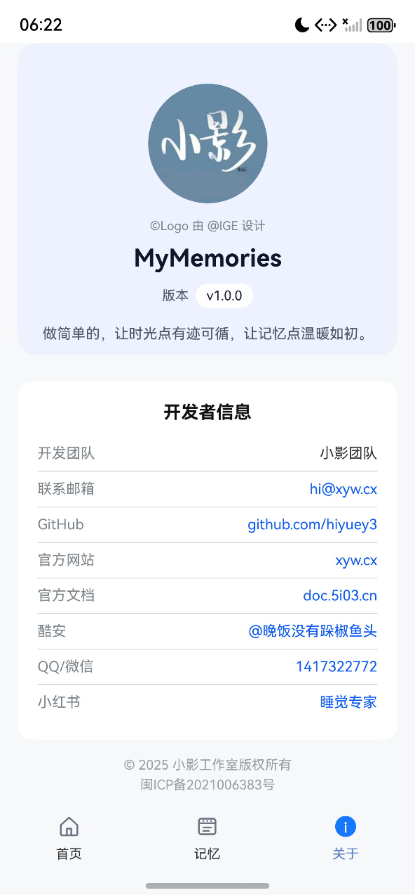 | 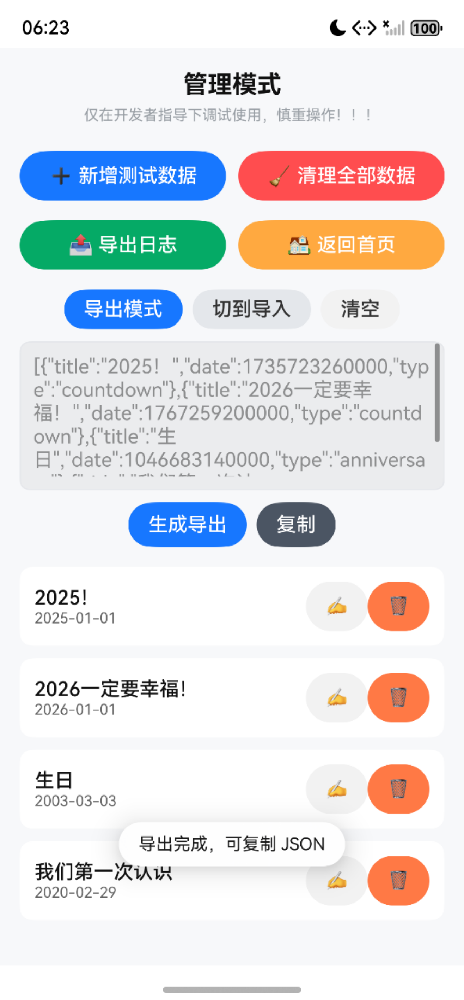 | 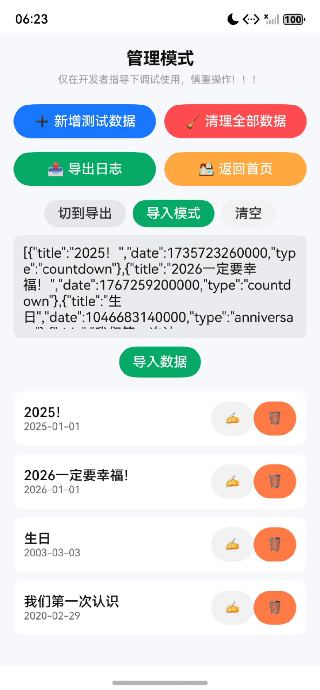 |

五、遇到关键问题与解决方案
1. 问题：ArkTS 中 Stack 与 Column 的布局层级问题
   - 描述：在首页 Banner 上叠加文字时，直接使用 SVG 内部文字在部分设备无法显示。
   - 解决方案：采用 `Stack` 布局，将 SVG 图片作为底层背景，上层叠加 `Column` 包裹的 `Text` 组件，并添加半透明背景遮罩，确保文字在任何背景下都清晰可见。

2. 问题：底部按钮在长页面中的定位
   - 描述：在编辑页和详情页，当内容较少时按钮在中间，内容多时需滚动。
   - 解决方案：使用 `Flex` 布局或 `Column` + `Blank().layoutWeight(1)` 占位符，将操作按钮区域强制推至页面最底部，保证交互体验一致性。

3. 问题：数据库异步操作与 UI 刷新
   - 描述：数据修改后返回首页，列表未及时更新。
   - 解决方案：利用 `AppStorage` 设置全局标记 `needsReload`，在页面 `onShow` 或 `aboutToAppear` 生命周期中检查该标记并重新加载数据。

六、个人收获与反思
通过开发 MyMemories，深入理解了 HarmonyOS ArkTS 的声明式 UI 开发范式。
- 技术层面：掌握了 RDB 本地数据库的封装与使用，熟悉了 ArkUI 常用组件（List, Stack, Picker 等）的属性与布局规则。
- 产品思维：在设计 UI 时，学会了从用户角度思考，例如增加“备注”的占位显示、优化底部按钮的触达区域、以及添加“开发者模式”方便数据迁移。
- 不足与展望：目前应用仅支持本地存储，未来考虑接入云服务实现多端同步；同时计划增加桌面卡片（Service Widget）功能，让倒数日查看更便捷。

七、附加信息

7.1 配色方案 (Color Scheme)
为增强 UI 的语义化识别与视觉一致性，项目采用了三种主要颜色：
- 倒数日（Countdown） — Ultramarine: `#5A7CC2`
  - 含义（中文）：群青色常用于表达冷静、专业与信任感，在倒数场景中传达“聚焦准备、稳步倒计”的情绪。
  - Meaning (EN): Ultramarine conveys calmness and focus; suitable for countdowns where the user needs to prepare.
  - 参考色意（参考）：https://www.canva.cn/colors/color-meanings/ultramarine/
- 纪念日（Anniversary） — Coral: `#FF7F50`
  - 含义（中文）：珊瑚色（浅珊瑚）温暖且具有情感指向，适合作为“纪念/回顾”类事件的强调色，传递亲切与回忆感。
  - Meaning (EN): Coral is warm and emotive, good for anniversary/retroactive events to convey warmth and nostalgia.
  - 参考色意（参考）：https://www.canva.cn/colors/color-meanings/coral/
- 全局主题色（Theme / Accent） — Theme Blue: `#1677FF`
  - 含义（中文）：作为应用的主视觉强调色（例如部分图标或高亮态），蓝色带来科技感与可靠性，与群青和珊瑚形成冷暖平衡。
  - Meaning (EN): Theme blue is used as the global accent for primary actions and icons. It pairs with ultramarine and coral to create a balanced cool/warm palette.

使用建议 / Usage guidelines:
- 在事件类型标识和关键数字（例如首页“即将到来”计数）中使用语义色（`#5A7CC2` 或 `#FF7F50`）以增强信息识别。
- 按钮、交互态和底部导航图标的“激活/选中”状态可使用主题色 `#1677FF` 或根据场景改为 `#5A7CC2`，以保持视觉一致性。
- 文本与背景的对比需满足可读性，浅色背景上使用深色文本，彩色按钮上使用白色文字以保证可读性。

示例（当前实现）：
- 倒数日卡片与标签：`#5A7CC2`（群青）
- 纪念日卡片与标签：`#FF7F50`（珊瑚）
- 底部标签文字（选中态）: `#5A7CC2`（已在底部标签中采用群青）
- 主题/图标激活色：`#1677FF`（保留部分资源与图标文件使用该色）

7.2 参考与鸣谢 (References & Credits)
- 小影Logo 设计：@IGE
- 新Logo @hiyuey3


- 参考文档：HarmonyOS 开发者官网 https://developer.huawei.com/consumer/cn/
- 开源地址：GitHub - MyMemories https://github.com/hiyuey3

---

附录 A：开发与运行指南（供评审/贡献者使用）
- 平台与版本：HarmonyOS（Stage 模式），目标/兼容 SDK：6.0.1(21)（见 `build-profile.json5`）
- 模块：entry（主应用），ohosTest（测试）
- 依赖管理：ohpm（根与 `entry/` 各自安装）；测试框架：Hypium

A.1 环境准备
- DevEco Studio：与 HarmonyOS SDK 6.0.1(21) 兼容版本
- Node.js LTS，ohpm 可用（PATH 正确）
- 设备：HarmonyOS 手机或模拟器（deviceTypes: phone）

A.2 快速运行（DevEco Studio）
1) 打开项目根目录 → 同步依赖（ohpm）
2) 选择设备/模拟器 → Run ▶

A.3 快速构建（Windows PowerShell · CLI）
```powershell
ohpm --version
ohpm install
cd entry; ohpm install; cd ..

npx hvigor clean
npx hvigor assemble --mode debug
# 产物：entry/build/outputs/default/entry-default-unsigned.hap
# Release（需签名）：
# npx hvigor assemble --mode release
```

A.4 测试（Hypium）
- 目录：`entry/src/ohosTest/`、`entry/test/`
- 方式：DevEco Studio 选择 ohosTest 运行；或 `npx hvigor --tasks` 查看测试相关任务

A.5 代码规范
- 规则文件：`code-linter.json5`；建议使用 DevEco Studio 的 Linter/Reformat

附录 B：目录与配置索引
```
.
├─ AppScope/app.json5                 # 应用配置（bundleName, version 等）
├─ entry/
│  ├─ src/main/ets/                   # 组件、页面、ability、utils、store、types
│  ├─ src/main/resources/             # base/dark/rawfile
│  ├─ src/ohosTest/ / test/           # 测试
│  ├─ build-profile.json5             # 模块构建
│  └─ oh-package.json5                # 模块依赖
├─ build-profile.json5                # 应用构建（products/SDK/buildModeSet）
├─ hvigor/ hvigorfile.ts              # 构建工具（@ohos/hvigor-ohos-plugin）
├─ oh-package.json5                   # 根依赖（Hypium, Hamock）
└─ 文档：USER_GUIDE.md / DEVELOPER_GUIDE.md / PROJECT_OVERVIEW.md / API_REFERENCE.md
```

八、TODO 与未来工作
TODO.md
